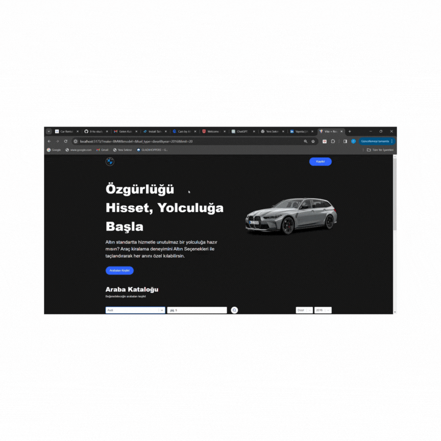

# ts_carRental
## home page
🚗The project targets a website that offers car rental services to users. The main goal is to enable users to access detailed information about rental cars and filter them according to their desired criteria.

## 🚀Technological Structure:

✅React: React is used for the user interface. React is a component-based library.
✅TypeScript:Project static type is used to ensure safety. TypeScript contributes to making your code more robust and reliable when used with React.
✅Vite:Vite is used to provide a fast development environment.
✅API: A connection is established to get information such as the rental status, price, make, model of the vehicle.
✅Vehicle List and Filtering: The home page includes a widget that lists the vehicles available for rent to users. Users can limit the vehicles with filtering options such as brand, model, price range.

## ts_carRental

## ⚙️Used Technologies:

📍React
📍React-router-dom
📍React-select
📍TypeScript
📍Tailwind
